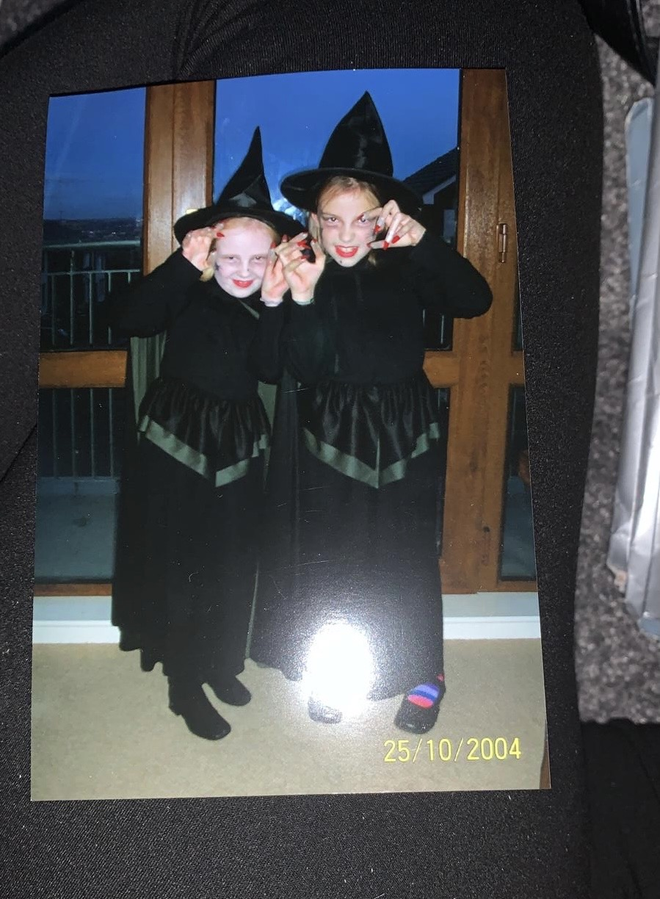

## About Me

My name is [Erica McGovern](https://www.linkedin.com/in/erica-mcgovern-65356b140/) and I am from Belfast, Northern Ireland. I recently graduated with a BSc in Criminal Justice and Criminology (Quantitative)(International) from the Univeristy of Leeds. I am currently a first year [CDT](https://datacdt.org) student, working towards an MSc and PhD.  

I am a beginner programmer, and my current main experience lies in R, for data cleaning, analysis, and representation. I also have some basic Python experience, and I am currently working on broadening my knowledge of the language as it will be essential throughout my PhD project. 

## PhD Project 

Click [here](phdinfo.md) to find out more about my PhD project.

## Programming Projects

[GEOG5995M Programming for Social Science Core Skills: Assignment 1](geogassignment1.md)
