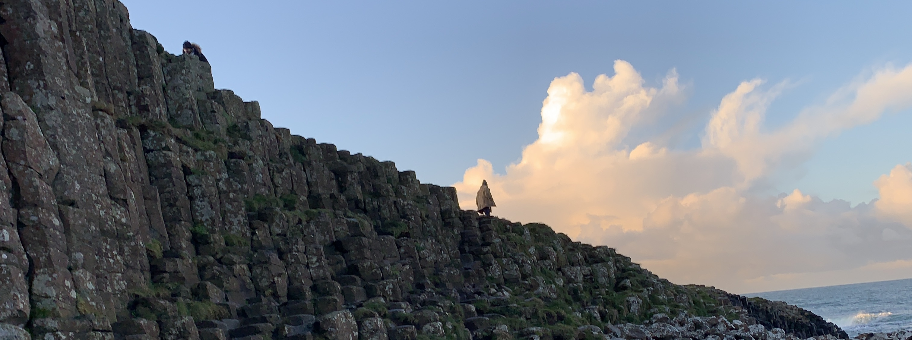

## About Me

My name is [Erica Kane](https://www.linkedin.com/in/erica-kane-65356b140/) and I am from Belfast, Northern Ireland. I recently graduated with a BSc in Criminal Justice and Criminology (Quantitative)(International) from the University of Leeds. I am currently a second year [CDT](https://datacdt.org) student, working towards an MSc and PhD in Data Analytics and Society.  

I am a beginner data analyst, and my current main experience lies in R and Python. I have complete projects across a variety of topics using several different analytical methods including: 

- Logistic and linear regression models 
- Data visualisation 
- Agent based modelling 
- Machine learning 
  - K-means clustering 
  - Random forest
  - UMAP
  - Classifiers 
- Natural language processing 
  - Text preparation
  - Sentiment analysis 
  - Word frequencies and co-occurrences  

## PhD Project 

Click [here](phdinfo.md) to find out more about my PhD project.

## Projects

[Sheep and wolves (ABM)](geogassignment1.md)

[Planning for drunks (ABM)](geogassignment2.md)

[Predicting social trust (ML - k-means and RF)](DSS.md)

